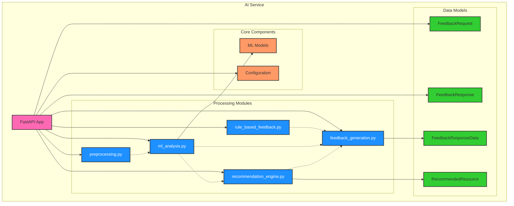

```mermaid
graph TB
    subgraph "AI Service"
        API[FastAPI App]
        
        subgraph "Core Components"
            Config[Configuration]
            Models[ML Models]
        end
        
        subgraph "Processing Modules"
            Preproc[preprocessing.py]
            RuleFB[rule_based_feedback.py]
            MLAnalysis[ml_analysis.py]
            RecEngine[recommendation_engine.py]
            FeedGen[feedback_generation.py]
        end
        
        subgraph "Data Models"
            FReq[FeedbackRequest]
            FResp[FeedbackResponse]
            FRespData[FeedbackResponseData]
            RecRes[RecommendedResource]
        end
    end
    
    API --> FReq
    API --> FResp
    
    API --> Preproc
    API --> RuleFB
    API --> MLAnalysis
    API --> RecEngine
    API --> FeedGen
    
    Preproc -.-> MLAnalysis
    RuleFB -.-> FeedGen
    MLAnalysis -.-> FeedGen
    MLAnalysis -.-> RecEngine
    RecEngine -.-> FeedGen
    
    FeedGen --> FRespData
    RecEngine --> RecRes
    
    MLAnalysis --> Models
    API --> Config
    
    classDef core fill:#f96,stroke:#333,stroke-width:2px
    classDef module fill:#1e90ff,stroke:#333,stroke-width:2px,color:white
    classDef data fill:#32cd32,stroke:#333,stroke-width:2px
    classDef api fill:#ff69b4,stroke:#333,stroke-width:2px
    
    class Config,Models core
    class Preproc,RuleFB,MLAnalysis,RecEngine,FeedGen module
    class FReq,FResp,FRespData,RecRes data
    class API api
``` 