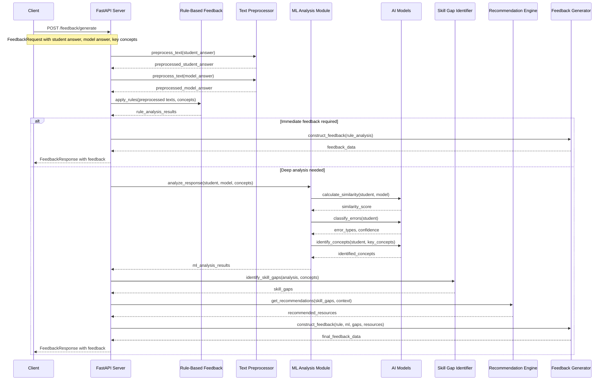

```mermaid
sequenceDiagram
    participant Client
    participant FastAPI as FastAPI Server
    participant RuleFeedback as Rule-Based Feedback
    participant Preprocess as Text Preprocessor
    participant ML as ML Analysis Module
    participant Models as AI Models
    participant SkillGap as Skill Gap Identifier
    participant Recommend as Recommendation Engine
    participant Feedback as Feedback Generator
    
    Client->>FastAPI: POST /feedback/generate
    Note over Client,FastAPI: FeedbackRequest with student answer, model answer, key concepts
    
    FastAPI->>Preprocess: preprocess_text(student_answer)
    Preprocess-->>FastAPI: preprocessed_student_answer
    
    FastAPI->>Preprocess: preprocess_text(model_answer)
    Preprocess-->>FastAPI: preprocessed_model_answer
    
    FastAPI->>RuleFeedback: apply_rules(preprocessed texts, concepts)
    RuleFeedback-->>FastAPI: rule_analysis_results
    
    alt Immediate feedback required
        FastAPI->>Feedback: construct_feedback(rule_analysis)
        Feedback-->>FastAPI: feedback_data
        FastAPI-->>Client: FeedbackResponse with feedback
    else Deep analysis needed
        FastAPI->>ML: analyze_response(student, model, concepts)
        
        ML->>Models: calculate_similarity(student, model)
        Models-->>ML: similarity_score
        
        ML->>Models: classify_errors(student)
        Models-->>ML: error_types, confidence
        
        ML->>Models: identify_concepts(student, key_concepts)
        Models-->>ML: identified_concepts
        
        ML-->>FastAPI: ml_analysis_results
        
        FastAPI->>SkillGap: identify_skill_gaps(analysis, concepts)
        SkillGap-->>FastAPI: skill_gaps
        
        FastAPI->>Recommend: get_recommendations(skill_gaps, context)
        Recommend-->>FastAPI: recommended_resources
        
        FastAPI->>Feedback: construct_feedback(rule, ml, gaps, resources)
        Feedback-->>FastAPI: final_feedback_data
        
        FastAPI-->>Client: FeedbackResponse with feedback
    end
``` 