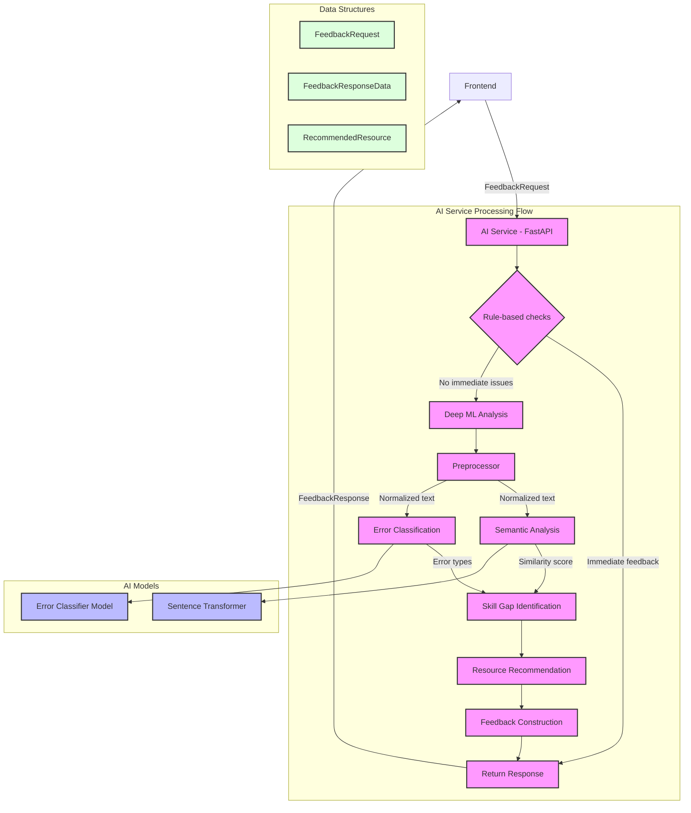

```mermaid
graph TD
    A[Frontend] -->|FeedbackRequest| B[AI Service - FastAPI]
    
    subgraph "AI Service Processing Flow"
        B --> C{Rule-based checks}
        C -->|Immediate feedback| D[Return Response]
        C -->|No immediate issues| E[Deep ML Analysis]
        
        E --> F[Preprocessor]
        F -->|Normalized text| G[Semantic Analysis]
        F -->|Normalized text| H[Error Classification]
        
        G -->|Similarity score| I[Skill Gap Identification]
        H -->|Error types| I
        I --> J[Resource Recommendation]
        
        J --> K[Feedback Construction]
        K --> D
    end
    
    D -->|FeedbackResponse| A
    
    subgraph "AI Models"
        M1[Sentence Transformer]
        M2[Error Classifier Model]
    end
    
    G --> M1
    H --> M2
    
    subgraph "Data Structures"
        DS1[FeedbackRequest]
        DS2[FeedbackResponseData]
        DS3[RecommendedResource]
    end
    
    classDef service fill:#f9f,stroke:#333,stroke-width:2px
    classDef model fill:#bbf,stroke:#333,stroke-width:2px
    classDef data fill:#dfd,stroke:#333,stroke-width:2px
    
    class B,C,D,E,F,G,H,I,J,K service
    class M1,M2 model
    class DS1,DS2,DS3 data
``` 